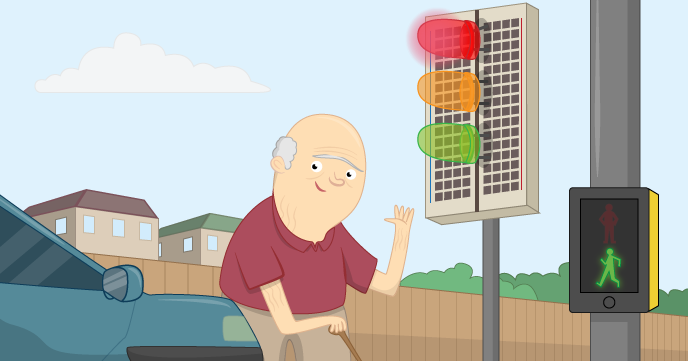

# CamJam Edu Kit 1

Get started with CamJam Edu Kit 1 using Python and GPIO Zero. CamJam Kit 1 contains a breadboard, three LEDs, a button, a buzzer and the necessary jumper cables and resistors.

## Requirements

As well as a Raspberry Pi with an SD card loaded with Raspbian Jessie, you'll also need:

### Hardware

- 1 x [CamJam Edu Kit 1](https://thepihut.com/products/camjam-edukit), comprising:
    - 1 x [Tactile Push Button](http://shop.pimoroni.com/products/tactile-switches)
    - 1 x [Red LED](http://shop.pimoroni.com/products/led-5mm-pack-of-10)
    - 1 x [Amber LED](http://shop.pimoroni.com/products/led-5mm-pack-of-10)
    - 1 x [Green LED](http://shop.pimoroni.com/products/led-5mm-pack-of-10)
    - 1 x [Buzzer](http://www.rapidonline.com/audio-visual/rvfm-6v-buzzer-low-profile-35-0040)
    - 1 x [Full size breadboard](http://shop.pimoroni.com/products/solderless-breadboard-400-point)
    - 3 x [330R resistors](http://shop.pimoroni.com/products/resistor-grab-bag)
    - 6 x [Male-to-female jumper wires](http://shop.pimoroni.com/products/jumper-jerky)
    - 1 x [Male-to-male jumper wire](http://shop.pimoroni.com/products/jumper-jerky)

### Software

- GPIO Zero

See more information on installing this software on the [software installation](software.md) page.

## Worksheet

- [The worksheet](worksheet.md)

## Licence

Unless otherwise specified, everything in this repository is covered by the following licence:

***CamJam Edu Kit 1*** by the [Raspberry Pi Foundation](https://www.raspberrypi.org/) is licensed under a [Creative Commons Attribution 4.0 International Licence](http://creativecommons.org/licenses/by-sa/4.0/).

Based on a work at https://github.com/raspberrypilearning/camjam-kit-1
